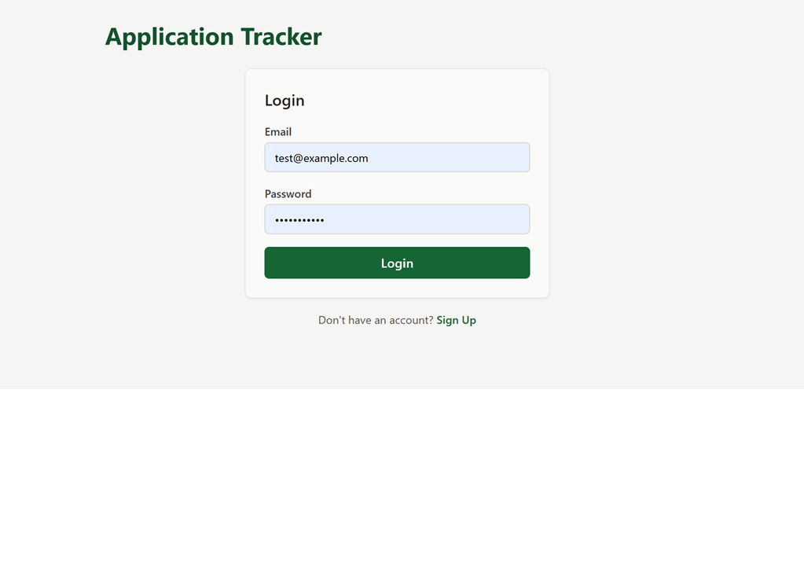
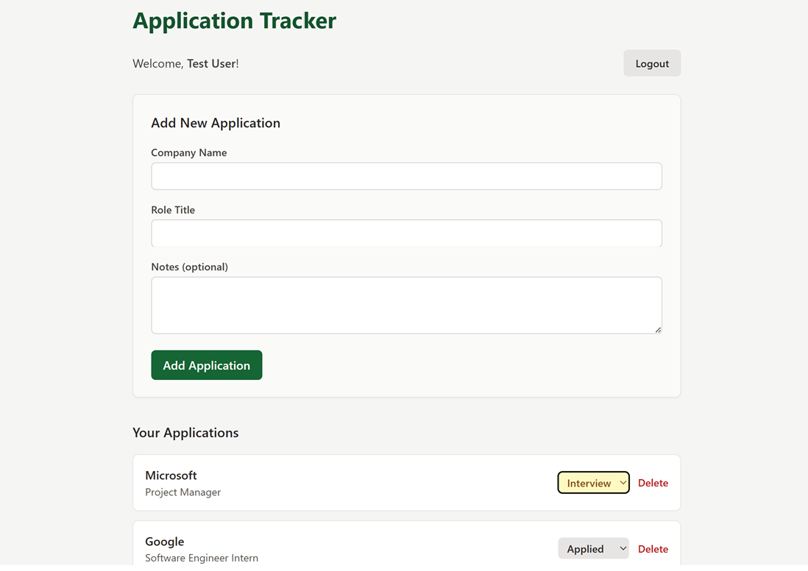

# Application Tracker

A full-stack web app for tracking job/internship applications — built to manage my own internship search, and to practice full-stack development end to end.
## Live Demo
[https://application-tracker-u7d4.vercel.app/](https://application-tracker-u7d4.vercel.app/)

## Features
- User authentication (signup/login) with hashed passwords and JWT-based sessions
- Create, view, update, and delete job applications
- Track application status (Applied → Interview → Offer/Rejected) with color-coded badges
- Persistent login sessions across page refreshes
- Each user only sees and manages their own applications

## Tech Stack
**Frontend:** React, Tailwind CSS, Axios
**Backend:** Node.js, Express
**Database:** PostgreSQL
**Auth:** JWT (jsonwebtoken), bcrypt for password hashing

## Screenshots

## Running Locally

### Prerequisites
- Node.js
- PostgreSQL

### Backend Setup

cd backend
npm install

Create a `.env` file in `backend/` with:

DB_USER=your_postgres_user
DB_PASSWORD=your_postgres_password
DB_HOST=localhost
DB_PORT=5432
DB_NAME=application_tracker
JWT_SECRET=your_secret_key

Then create the database and run the SQL in `backend/schema.sql` (see below) before starting the server:

node server.js

### Frontend Setup

cd frontend
npm install
npm start

## Database Schema
See `backend/schema.sql` for the full table definitions (`users` and `applications`).

## What I Learned
- Building a complete REST API with authentication from scratch (no auth libraries/services)
- Structuring a full-stack app with a clear separation between frontend and backend
- Using JWTs for stateless authentication and protecting routes with middleware
- Styling with Tailwind CSS utility classes
- Git/GitHub workflow for a multi-part project

## Future Improvements
- Handle token expiry gracefully on the frontend
- Add a full edit form (currently only status is editable inline)
- Deploy live (in progress)

A few things to do before this is fully accurate:

Create backend/schema.sql — right now your table structure only exists inside pgAdmin, not as a file anyone can reference. Create this file with:
sql
CREATE TABLE users (
  id SERIAL PRIMARY KEY,
  name VARCHAR(100) NOT NULL,
  email VARCHAR(100) UNIQUE NOT NULL,
  password VARCHAR(255) NOT NULL,
  created_at TIMESTAMP DEFAULT NOW()
);

CREATE TABLE applications (
  id SERIAL PRIMARY KEY,
  user_id INTEGER REFERENCES users(id) ON DELETE CASCADE,
  company_name VARCHAR(100) NOT NULL,
  role_title VARCHAR(100) NOT NULL,
  status VARCHAR(50) DEFAULT 'applied',
  applied_date DATE DEFAULT CURRENT_DATE,
  notes TEXT,
  created_at TIMESTAMP DEFAULT NOW()
);